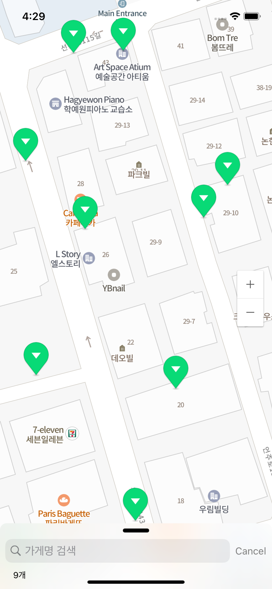
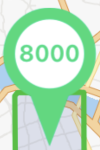
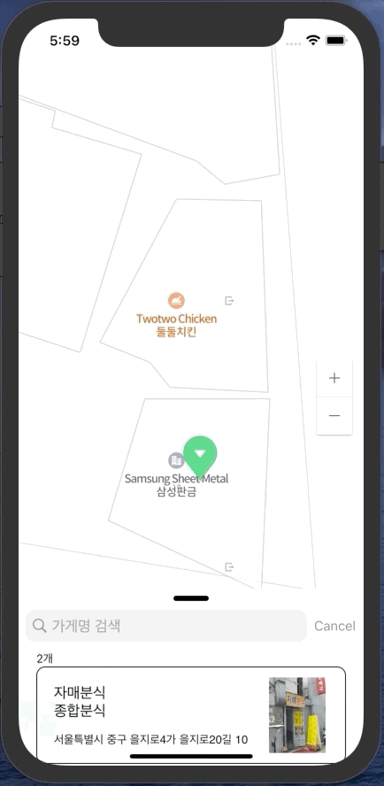

<div align="center">


📆 2020.11.16 ~ 2020.12.18

[Wiki Documentation](https://github.com/boostcamp-2020/Project17-B-Map/wiki)&nbsp;&nbsp;&nbsp;|&nbsp;&nbsp;&nbsp;[Issue](https://github.com/boostcamp-2020/Project17-B-Map/issues)

[](https://developer.apple.com/kr/swift/)
[](https://developer.apple.com/kr/xcode/)
[](https://developer.apple.com/kr/xcode/)

[](https://github.com/boostcamp-2020/Project17-B-Map/issues)
[](https://github.com/boostcamp-2020/Project17-B-Map/issues?q=is%3Aissue+is%3Aclosed)
[](https://github.com/boostcamp-2020/Project17-B-Map/pulls)
[](https://github.com/boostcamp-2020/Project17-B-Map/pulls?q=is%3Apr+is%3Aclosed)

[](https://github.com/boostcamp-2020/Project17-B-Map)
[](https://opensource.org/licenses/MIT)

</div>

## 디렉토리 구조
<details>
  <summary>파일 구조 :file_cabinet: </summary>
    <div markdown=“1”>
      <pre>
Mab_Project
├── AppDelegate.swift
├── BoostClusteringMaB.xcdatamodeld
│   └── BoostClusteringMaB.xcdatamodel
│       └── contents
├──📁 Clustering
│   ├── Cluster.swift
│   ├── Clustering.swift
│   ├── ClusteringProtocol.swift
│   ├── ConvexHull.swift
│   └── KMeans.swift
├──📁 CoreData
│   ├── CoreDataContainer.swift
│   ├── CoreDataLayer.swift
│   └──📁 Models
│       ├── ManagedPOI+CoreDataClass.swift
│       ├── ManagedPOI+CoreDataProperties.swift
│       └── POI.swift
├──📁 Extension
│   ├── CGPoint+Distance.swift
│   ├── CGPoint+isValid.swift
│   ├── NMFCameraUpdate+.swift
│   ├── NMFMarker+.swift
│   ├── NMFMarker+Animation.swift
│   ├── NMFPolygonOverlay+.swift
│   ├── String+Bundle.swift
│   ├── String+Localize.swift
│   └── UIColor+.swift
├── Info.plist
├── MainAnimationController.swift
├──📁 Models
│   ├── Geocoding.swift
│   ├── LatLng.swift
│   ├── LinkedList.swift
│   └── POIModel.swift
├──📁 Resources
│   ├──📁 Fonts
│   │   ├── BMEuljiro10yearslaterOTF.otf
│   │   ├── NanumSquareRoundOTFEB.otf
│   │   └── NanumSquareRoundOTFR.otf
│   └──📁 POIRawData
│       ├── csv
│       │   └── poi.csv
│       └── json
│           ├── gangnam_8000.json
│           └── restaurant.json
├── SceneDelegate.swift
├──📁 Scenes
│   ├──📁 Detail
│   │   ├── DetailViewController.swift
│   │   └──📁 View
│   │       └── DetailCollectionViewCell.swift
│   ├──📁 Loading
│   │   └── LoadViewController.swift
│   ├──📁 MainView
│   │   ├── AlertType.swift
│   │   ├──📁 Animations
│   │   │   └── MarkerAnimateController.swift
│   │   ├── MainInteractor.swift
│   │   ├── MainPresenter.swift
│   │   └── MainViewController.swift
│   └──📁 Views
│       ├── Base.lproj
│       │   ├── LaunchScreen.storyboard
│       │   └── Main.storyboard
│       ├── Detail.storyboard
│       ├── Loading.storyboard
│       └── MarkerImageView.swift
├──📁 Util
│   ├── AddressAPI.swift
│   ├── CSVParser.swift
│   ├── DataParser.swift
│   ├── ImageDownloader.swift
│   └── JsonParser.swift
└── en.lproj
    └── Localizable.strings
         </pre>
    </div>
</details>

# Map App 
[](https://github.com/boostcamp-2020/Project17-B-Map/releases)
[](https://github.com/boostcamp-2020/Project17-B-Map/actions)

배조주소🎯: [https://kr.object.ncloudstorage.com/mab/project/download.html](https://kr.object.ncloudstorage.com/mab/project/download.html)

# Author

|  |  |  |  |  |
| ----------------------------------------------------------- | ------------------------------------------------------------ | ------------------------------------------------------------ | ------------------------------------------------------------ | ------------------------------------------------------------ |
|  **[S001] 강민석** <br>[@kati-kms](https://github.com/kati-kms)   |  **[S009] 김석호** [@SeokBA](https://github.com/seokBA)   |  **[S018] 박재현** [@wogus3602](https://github.com/wogus3602)     |  **[S057] 조정래** [@chojl1125](https://github.com/chojl1125)     |  **[S063] 현기엽** [@KYHyeon](https://github.com/KYHyeon)     |

# Requirements
 - iOS 14.0+
 - Xcode 12.2+
 - Swift 5.3+
 
# Cocoapods

```ruby
target 'BoostClusteringMaB' do
  use_frameworks!

  pod 'SwiftLint'
  pod 'NMapsMap'


  target 'BoostClusteringMaBTests' do
    pod 'NMapsMap'
  end
end
```

# Installation
1. 대용량 파일을 받기 위해 [git-lfs](https://git-lfs.github.com/)를 설치해야합니다.
```
brew install git-lfs
```

2. 프로젝트 폴더에서 git-lfs 초기화를 해줘야 합니다.
```
git-lfs install
```

3. SDK를 최신 버전으로 업데이트 합니다.
```
$ pod install --repo-update
```

# 📌 프로젝트 목표
```
1. 많은 POI데이터를 K-means 알고리즘을 활용하여 클러스터링된 UI 제공
2. ConvexHull 알고리즘을 활용하여 클러스터링 된 영역을 구분해주는 UI 제공
3. 클러스터를 4~5번 클릭으로 사용자가 원하는 지점을 찾을 수 있도록 하는 UX 제공
```

# 🧾 프로젝트 소개 


## POI & 클러스터
| POI(Point Of Interest)란? | 클러스터란? |
| :-: | :-: |
|   |  |
| 원하는 장소나 지점을 초록색 마커등을 활용해 표시할 수 있다. | POI 8000개가 1개의 클러스터로 클러스터링 된 모습 |


## 클러스터링이란?
- 클러스터링(군집화)은 개체들이 주어졌을 때, 개체들을 몇 개의 클러스터(부분 그룹)으로 나누는 과정을 의미합니다.
```
💡 클러스터링 기술을 사용한 이유

  1. 수많은 마커들을 그룹으로 묶으면서, 유저들에게 더 좋은 UX제공 목적
  2. 사용자들이 맵 전체를 쉽게 이해할 수 있다.
```

| 📚 로딩 애니메이션 |  설명 |
| - | - | 
|   | - 로딩 하는 동안 사용자가 지루하지 않도록 마커가 **통통** 튀는 애니메이션을 제공합니다. <br/> - 로딩 할 때 POI 정보에 대한 Json Data를 **코어데이터에 저장**합니다.  |

| 📕 클러스터링 | 설명 |
| - | - | 
|  | - 화면이 움직일 때마다 **클러스터링과 영역을 새로 그려**줍니다. <br/> - 클러스터들이 **합쳐지고 분리**되는 애니메이션을 실행합니다.  |

| 📗 클러스터링 클릭 | 설명 |
| - | - | 
|  | - 클러스터 클릭 시 해당 **영역으로 지도가 확대**됩니다.<br/> - 8000개의 POI 기준 평균 4~5회 내에 leaf Marker 에 도달 합니다.  |

| 📘 POI 추가 | 설명 |
| - | - | 
|  | - 지도에 원하는 지점을 **꾹 누르면 POI를 추가**할 수 있습니다.  |

| 📙 POI 삭제 | 설명 |
| - | - | 
|  | - POI 마커를 누르면 **하이라이트**가 되고 위경도가 표시됩니다. <br/> - 하이라이트가 된 상태에서 **한번 더 클릭**시, **POI를 삭제**할 수 있습니다.  |

| 📕 POI 검색 | 설명 |
| - | - | 
|  | - 현재 화면 내에서 POI 데이터를 **검색**(가게명 기준) 할 수 있습니다. |

| 📗 Cell 클릭 | 설명 |
| - | - | 
|  | - 리스트에서 셀을 터치하면 **POI의 위치를 알려주는 애니메이션**을 보여줍니다. <br/> - 이 상태로 셀을 **한번 더 누르면 해당하는 좌표로 카메라를 이동시킬** 수 있습니다.  |

| 📘 Cell을 통한 다양한 정보 제공 | 설명 |
| - | - | 
|  | - 각각의 셀에서 이름과 카테고리와 주소와 가게 사진을 볼 수 있습니다. <br/> - POI의 위치를 **위경도기반**으로 주소를 보여줍니다. <br/> - 이미지 캐싱을 통한 높은 반응속도를 제공합니다.  |

| 📙 Collection View | 설명 |
| - | - | 
|  | - 화면 하단의 Collection View를 통해 **POI를 리스트** 형식으로 볼 수 있습니다. <br/> - Colletion View는 사용자의 드래그를 통해 크기를 **3단계**로 조절할 수 있습니다.  |

### 📙 Drawer
| Layergroup | Setting | Maptype | UserDefault |
| :-: | :-: | :-: | :-: |
|  |   |  |  |


## 기술

### ❓ 쿼드트리, K-Means 알고리즘 선택에 대한 고민

| | 장점 | 단점 |
| -- | :-: | :-: |
| 쿼드트리  | 1. Tree완성 후 탐색 속도가 빠르다. | 1. 사각형 경계선에 있는 POI들의 문제점 <br/> 2. 클러스터 모양이 이쁘지 않다는 점 |
| K-Means  | 1. 클러스터 후 자연스러운 모양 | 1. POI갯수가 엄청 많아지면 클러스터가 랜더링 되는 속도가 느리다.  <br/>2. 매번 계산할 때 마다 클러스터 모양이 바뀔수 있음 |

### ⚠️ 각각의 장단점을 팀원들과 논의를 한 후 K-means를 선택했습니다.
  1. 사용자들을 생각하며 앱을 개발하자.
  2. 사용자들이 사용하는 지도에 POI가 아무리 많아도 10,000개 이상은 안 넘을것이다.
  3. 경계선 문제를 해결하지 못하거나 클러스터 모양이 이쁘지 않다면 사용자들이 사용하기에 거북할 것 이다.
  
  - 💡 위와 같은 고민 후 K-means를 선택했고, 개발하는 동안 K값의 선택과 최적화에 집중해서 개발했고 팀원들 모두 노력한 끝에 만족스러운 결과가 나왔습니다.  
---

### 클러스터링 알고리즘(K-Means)

```markdown
1. 시간복잡도: O(nk)
    - n=8000개의 데이터 기준으로 약 0.5초
    
2. 시간복잡도를 줄이려는 노력
    1. LinkedList를 활용해서 요소 삭제할 때 O(1)로 배열의 O(n)보다 빠르게 계산
    2. 반복적으로 계산하는 코드를 한번에 계산
        - 클러스터의 중심을 계산하는 것을 매번 모든 점을 돌지 않고 point가 이동할때마다 미리 계산
    3. K값 검증을 위해 여러 k값으로 kMeans를 돌릴때 시간이 오래걸린다.
        - 비동기처리(async), 동시 프로그래밍(concurrent)
        
3. K 값 검증
    - Davies-Bouldin index를 활용하여 클러스터 내 응집도와 클러스터 간 결합도, 두가지를 고려
    
4. 누적된 Clustering 계산을 삭제
    1. DispatchGroup을 활용하여 비동기 처리를 했으나 화면을 계속해서 움직이면 계산이 누적되는 문제 발생
    2. Operation을 활용하여 이전에 계산하려고 했던 Clustering을 cancel 후 다시 계산
    
5. 사용자에게 보이는 클러스터를 개선하기 위한 방법
    - K-Means로 계산을 한 후 클러스터간 거리로 한번 더 클러스터링 진행
    - 5~7번 클릭해야 원하는 지점을 찾을 수 있는것을 줌 레벨에 따라 K 범위를 조절하여 4~5번으로 개선
```

### 애니메이션(CA, UIPropertyAnimation)
```markdown
1. 애니메이션 관련 기능이 없는 NaverMap SDK의 뷰 상단에서 전용 뷰를 만들어 애니메이션
2. 마커 애니메이션
    1. 마커들이 병합/분할되는 애니메이션
    2. UIPropertyAnimation를 사용해 애니메이션을 컨트롤
        1. 클러스터링 애니메이션 요청이 들어올 때 사용자에게 혼란을 주지 않기 위해 현재 실행중인 애니메이션이 있다면, 중지
        2. 애니메이션이 정상적으로 완료될 때, mapView에 Overlay
    3.  UIView의 draw 내에서 UIBezierPath를 사용해 클러스터 이미지 drawing
3. Point Dot 애니메이션
    1. 개별 Cell이 맵 어디에 있는지 사용자가 알 수 없어서 구현
    2. 개별 Cell이 클릭 되었을 때, 맵 내 위치를 표시해주는 애니메이션
    3. CoreAnimation 사용
4. LoadingView 애니메이션
    1. 앱이 실행되고 처음 로딩되는 동안 마커가 통통 튀면서 움직이는 애니메이션
    2. CABasicAnimation을 이용하여 애니메이션 생성
```

### CoreData
```markdown
1. 계층적 Managed Object Context를 이용하여 멀티 스레드 환경에서도 원활한 동작을 할 수 있게 만듬
2. CoreData를 사용하는 Layer 클래스를 분리하고 CoreDataManager Protocol을 만들어 응집도를 높이고 의존성을 줄였습니다.
```

### VIP
```markdown
### 채택한 이유

- 단순하게 MVC 패턴으로 구현하게 되면 View Controller 가 갖는 책임이 비대하게 되고 모듈 간 분리가 쉽지 않음
- 특히 Swift 에서는 VIew 와 Controller 간의 결합도가 높기 때문에, 자칫하면 Massive View Controller 가 될 가능성이 높다고 판단함
- 최대한 VC가 갖는 책임을 분산시켜, 모듈 간 결합도를 줄이고 가독성을 높이고자 함.
- 협업의 관점에서 최대한 단방향 흐름으로 로직 플로우가 진행되게 하여 혼란을 줄이고 싶었음.
- VIPER 패턴과 같이 로직이 양방향으로 순환하게 되면 Retain Cycle 에 의한 메모리 누수가 일어날 가능성이 존재
- 위와 같은 이유로 우리 팀은 단방향 플로우를 가지는 VIP 패턴을 선택하여 적용하기로 결정

### 각각의 역할

- View
    Storyboard 내부에서 User와 상호작용 하는 컴포넌트들

- Controller
    View 에 관련 된 property 나 action 등 상태를 바인딩하는 계층(VC)

- Interactor
    Controller에서 비즈니스 로직 부분을 분리하여 처리하는 계층

- Presenter
    Interactor로 부터 전달받은 결과에 대한 UI 처리 담당
```

### Area 표시
```markdown
1. 클러스터링 마커만으로는 해당하는 클러스터의 범위에 대한 정보를 사용자가 시각적으로 파악하기 힘들다고 판단하여, 각각의 클러스터가 포함 하고있는 영역을 표시해 주기 위해 ConvexHull 알고리즘을 활용
```

### 셀에 표기 될 Image와 Address 캐시처리
```markdown
1. 사용자에게 보이는 셀만 Image와 Address를 요청하여 받아오고 캐시처리
2. URLSession을 활용하여 Image를 받아옴
3. Reverse Geocoding API를 활용하여 위경도를 보내 Address를 받아옴
```

### GitHub Actions(CI)
```markdown
- 작업에 집중하기 위해 자동화 했습니다.
  1. iOS CI
      - Build와 Test를 자동화하여 매번 테스트코드를 돌려보는 과정을 없앴습니다.
  2. Auto Reviewer
      - PR을 올릴 때 항상 Reviewer를 다는 번거로움을 없앴습니다.
```

## License

This code is distributed under the terms and conditions of the [MIT license](LICENSE). 
